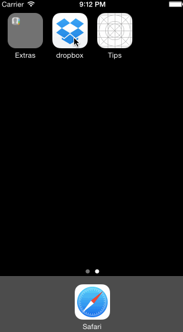

Dropbox

This is an iOS application that displays the sign-up and sign-in procedures for the Dropbox iOS application.

Time spent: 11 hours

Completed user stories:
\n[x] Required: User can tap through the 3 welcome screens.
\n[x] Required: User can follow the create user flow.
  \n\t[x] Required: On the create user form, the user can tap the back button to go to the page where they can sign in or create an account.
  \n\t[x] Required: Before creating the account, user can choose to read the terms of service.
  \n\t[x] Required: After creating the account, user can view the placeholders for Files, Photos, and Favorites as well as the Settings screen.
\n[x] Required: User can log out from the Settings screen.
  \n\t[x] Required: User can follow the sign in flow.
  \n\t[x] Required: User can tap the area for "Having trouble signing in?"
  \n\t[x] Required: User can log out from the Settings screen.
Optional: Add a detail view for one of the files and implement favoriting the file.
Optional: Add UITextFields for the forms so you can actually type in them and handle dismissing the keyboard.
Optional: You should be able to swipe through the welcome screens instead of just tapping them.

